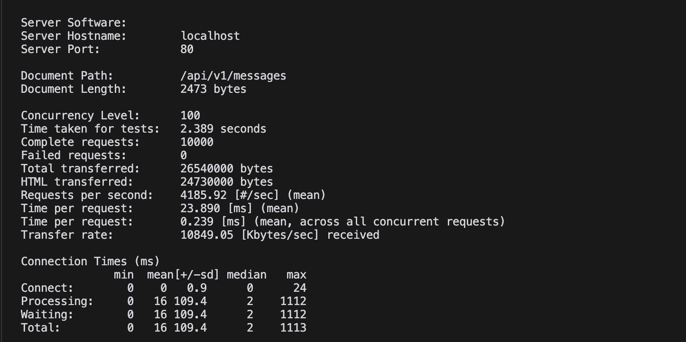

# Messaging Service

This project contains an API server and worker application that handles messaging tasks.

## Features
- Go-based API server
- Go-based Worker (Background jobs)

## Getting Started

These instructions will guide you to run the project on your local machine for development and testing purposes.

### Prerequisites

Software required to run the project:

- Docker
- Docker Compose
- Go (for generating Swagger documentation)
- Bash (for E2E tests)

### Installation and Running

1. Clone the project:
   ```
   git clone https://github.com/tmlsergen/messaging-service.git
   ```
   ```
   cd messaging-service
   ```

2. To start the application:
   ```
   make up
   ```
   This command will start the application in the background using Docker Compose and rebuild images if necessary.

3. To stop the application:
   ```
   make down
   ```

## Tests

To run E2E tests:

```
make test-e2e
```

This command will run the `src/api/scripts/e2e-testing.sh` script.

## API Documentation

To access Swagger documentation: http://localhost/swagger/index.html

## Project Structure

- `src/api/`: API server source code
- `src/worker/`: Worker application source code

## Benchmark

Apache Benchmark (ab) results:


